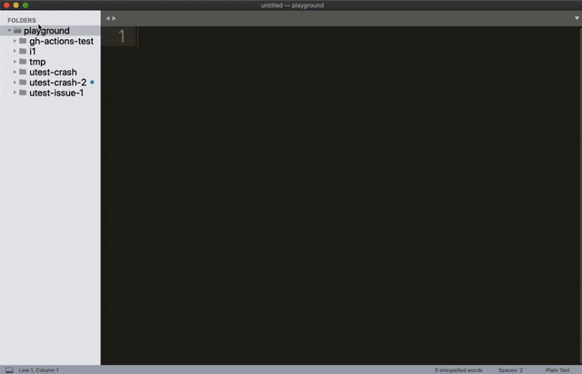

# Dotty Issue Runner


<p align="center">
  
</p>

This is an SBT plugin to aid in reproducing Dotty issues locally. It allows you to write a script that describes what needs to be done to reproduce an issue. This script currently supports SBT commands, shell commands and variables.

Say you have an issue that reproduces by compiling two files with Dotty. The second file needs the compiled first file on the classpath. You can write the following script that will be understood by the Dotty Issue Runner:

```scala
dotty-bootstrapped/dotc -d $here
  $here/A.scala

dotty-bootstrapped/dotc -d $here
  -Xprint:staging,reifyQuotes
  -Xprint-inline
  -Ycheck:all
  -Yprint-pos
  -classpath $here
  $here/B.scala
```

You can save it in a file `launch.iss` and execute it from SBT console.

The script above contains two SBT commands. Indented lines are joined with the lines without indentation using spaces, e.g. the first command becomes `dotty-bootstrapped/dotc -d $here $here/A.scala`. `$here` is a magic variable that points to the directory where the script resides.

## Usage
The plugin assumes you store your issues under the following directory structure:

```
workspace
├── i1
│   ├── File_1.scala
│   ├── File_2.scala
│   └── launch.iss
├── issue-30
│   ├── A.scala
│   └── launch.iss
└── stuff
    ├── A.scala
    ├── B.scala
    ├── C.scala
    └── launch.iss
```

Each issue has a dedicated folder – `i1`, `issue-30`, `stuff` etc. All the issue files reside there. Each issue folder also contains the `launch.iss` script which describes how to reproduce the issue. All of the issue folders reside in one parent folder, the issue workspace folder.

### Getting started
1. Clone this repo
2. Run `./install.sh`, this will copy the plugin sources to the SBT global plugins directory
3. Navigate to the Dotty repo and run `sbt` command
4. From SBT console, run `issuesWorkspace /path/to/issue/workspace`. This lets Dotty know where your issues are located
5. Run `issue issue_folder_name`. This reads the commands from `/path/to/issue/workspace/issue_folder_name/launch.iss` and executes them.

## Launch Script Syntax
The launch script syntax is as follows:

- Every command is on a new line.
- If a line is indented, it gets appended to the previous line without indentation.
- `$ <cmd>` – executes a command using `bash`
- `cd <dir>` – sets the working directory where `$` executes commands
- `val <name> = <value>` – defines a variable. You can use variables in commands via `$name`.
- `# Comment` – a comment
- Everything else is interpreted as an SBT command.

### Example
Say I want to:

1. Compile a 3rd party project (utest) with Dotty
2. Compile a Scala file `test.scala` with utest on the classpath.

I can make the following script:

```
# Publish Dotty to the local ivy repo
dotty-bootstrapped/publishLocal

# Define variables pointing where utest is
val utest_dir = /Users/kmetiuk/Projects/scala3/tools/ecosystem/repos/utest/
val utest_classpath =
  $utest_dir/out/utest/jvm/0.24.0-bin-SNAPSHOT/compile/dest/classes

# Compile utest using mill
cd $utest_dir
$ ./mill
  -D dottyVersion="0.24.0-bin-SNAPSHOT"
  utest.jvm[0.24.0-bin-SNAPSHOT].compile

# Compile the example file
dotty-bootstrapped/dotc -d $here
  -classpath $utest_classpath
  $here/test.scala
```